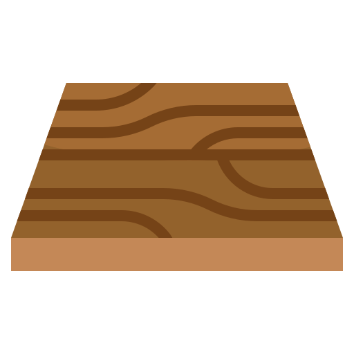

# Expo Floor
Interesting AR physical product showcase for an exposition company - made with 8th Wall + A-FRAME

[![LinkedIn][linkedin-shield]][linkedin-url]

<h2>Client</h2>

<b>StudioMollie - Belgium </b>

<!-- PROJECT LOGO -->
 

 

  

<h3 align="center">Expo Floor</h3>

  

AR 3D model placement experience with animation | using 8th Wall + AFRAME
  

  

<!-- ABOUT THE PROJECT -->
## About The Project

 

 
 
  I helped my client showcase their product (structures for expositions) in a captivating and innovative way by utilizing 8th Wall technology. By leveraging the power of 8th Wall, I was able to create a seamless and high-performing experience that runs smoothly on most devices. Not only did this solution meet the client's initial needs, but it can also be easily adapted and repurposed for future products, making it a versatile and cost-effective solution.

 

 
  <h3>Challenges</h3
   

    Although the project may seem straightforward, creating an engaging and responsive animation can be challenging in the context of WebAR. To tackle this issue, I applied a range of best practices, such as optimizing assets and reducing the size of texture files. In addition, I minimized the use of complex 3D models, and used efficient coding techniques to ensure smooth animation and high performance.
   

(<a href="#top">back to top</a>)

<!-- LICENSE -->
## License

All intellectual property is owned by Just For Men

<!-- CONTACT -->
## Contact

Reach out - <a href = "mailto: cappacurta@gmail.com">Victor Cappa</a>
<a href="https://www.linkedin.com/in/victor-cappa-50839788/">Linkedin</a>

(<a href="#top">back to top</a>)

[linkedin-shield]: https://img.shields.io/badge/-LinkedIn-black.svg?style=for-the-badge&logo=linkedin&colorB=555
[linkedin-url]: https://www.linkedin.com/in/victor-cappa-50839788/
